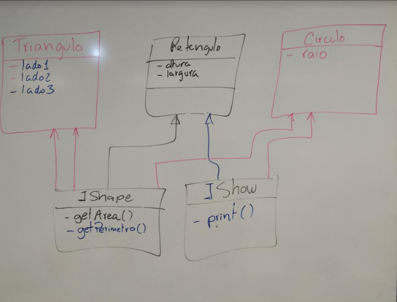

# Semana 8 - Interfaces e Exceções

1. Incluir o método getPerimetro() na interface IShape
2. Criar mais 2 classes Circulo e Triangulo que implementam IShape e IShow
3. Fazer um programa para testar as 3 Classes (Retangulo, Circulo e Triangulo) TestInterface
4. Implementar "Tratamento de Exceção" para a Classe TestInterface
